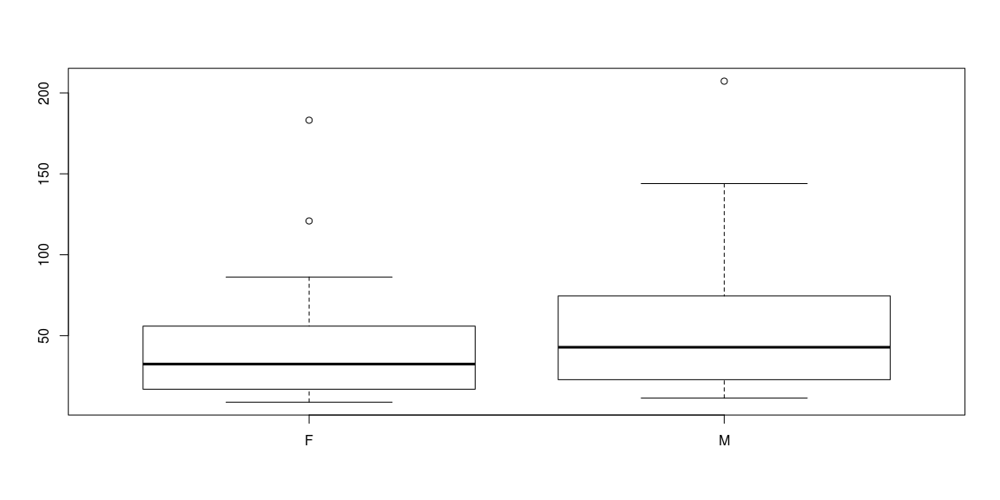
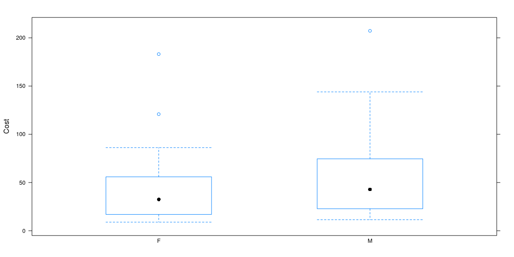
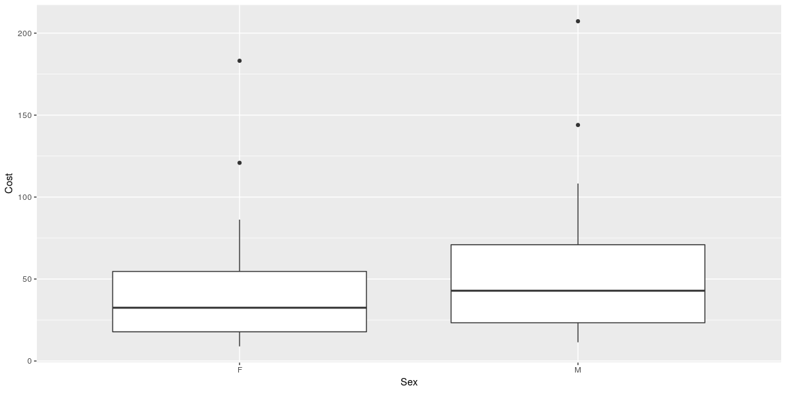
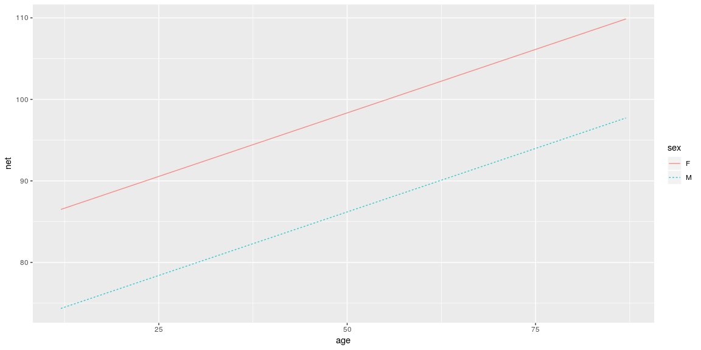
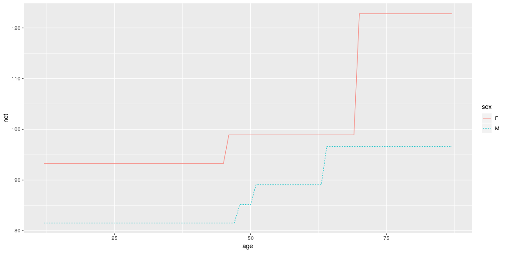
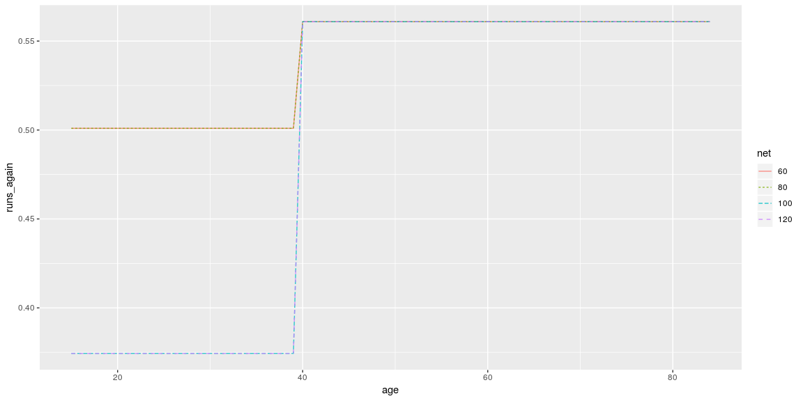
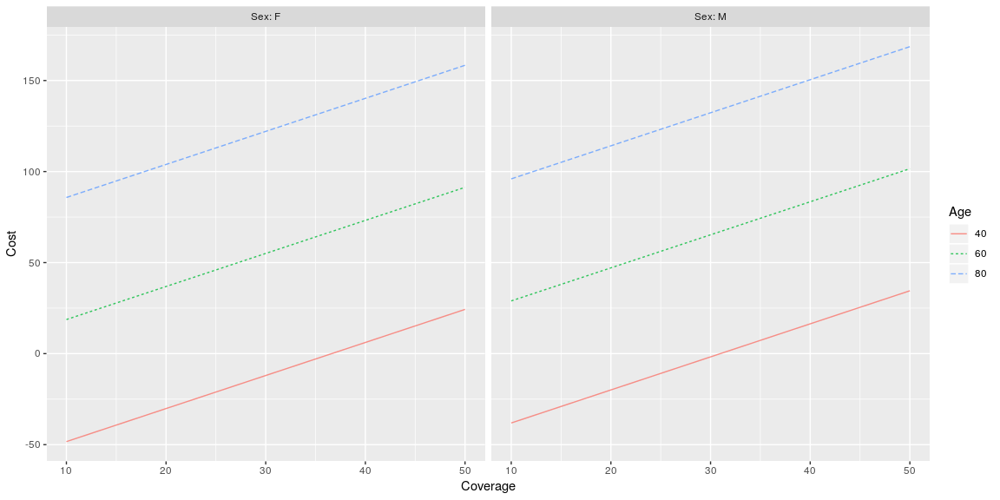
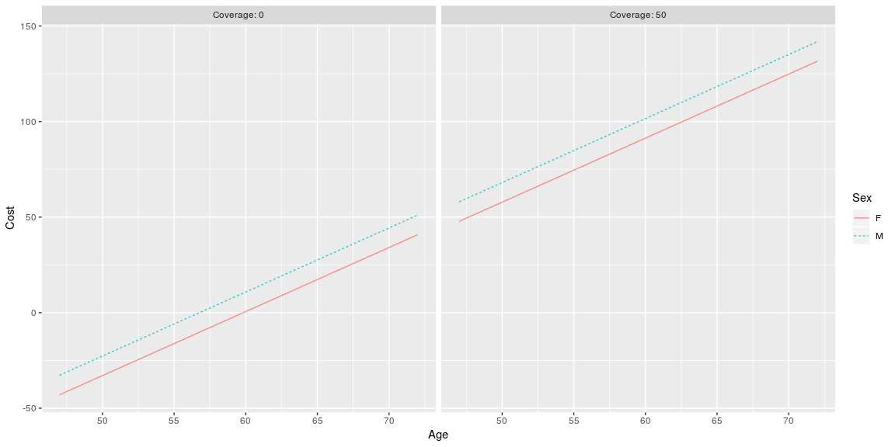

# {.tabset .tabset-fade}


## Background

https://www.datacamp.com/courses/statistical-modeling-in-r-part-1

## What is Statistical Modeling


```r
## Accessing Data

# Use data() to load Trucking_jobs
data("Trucking_jobs", package = "statisticalModeling")

# View the number rows in Trucking_jobs
nrow(Trucking_jobs)
```

```
## [1] 129
```

```r
# Use names() to find variable names in mosaicData::Riders
names(mosaicData::Riders)
```

```
##  [1] "date"    "day"     "highT"   "lowT"    "hi"      "lo"      "precip" 
##  [8] "clouds"  "riders"  "ct"      "weekday" "wday"
```

```r
# Load ggplot2 package
library(ggplot2)

# Look at the head() of diamonds
head(diamonds)
```

```
## # A tibble: 6 x 10
##   carat cut       color clarity depth table price     x     y     z
##   <dbl> <ord>     <ord> <ord>   <dbl> <dbl> <int> <dbl> <dbl> <dbl>
## 1 0.23  Ideal     E     SI2      61.5    55   326  3.95  3.98  2.43
## 2 0.21  Premium   E     SI1      59.8    61   326  3.89  3.84  2.31
## 3 0.23  Good      E     VS1      56.9    65   327  4.05  4.07  2.31
## 4 0.290 Premium   I     VS2      62.4    58   334  4.2   4.23  2.63
## 5 0.31  Good      J     SI2      63.3    58   335  4.34  4.35  2.75
## 6 0.24  Very Good J     VVS2     62.8    57   336  3.94  3.96  2.48
```

```r
##Starting with formulas

data("AARP", package = "statisticalModeling")

# Find the variable names in AARP
names(AARP)
```

```
## [1] "Age"      "Sex"      "Coverage" "Cost"
```

```r
# Find the mean cost broken down by sex
mosaic::mean(Cost~Sex, data = AARP)
```

```
##        F        M 
## 47.29778 57.53056
```

```r
## Graphics with Formulas

# Create a boxplot using base, lattice, or ggplot2
boxplot(Cost ~ Sex, data = AARP)
```

<!-- -->

```r
bwplot(Cost ~ Sex, data = AARP)
```

<!-- -->

```r
gf_boxplot(Cost ~ Sex, data = AARP)
```

<!-- -->

```r
# Make a scatterplot using base, lattice, or ggplot2
plot(Cost ~ Age, data = AARP)
```

<!-- -->

```r
xyplot(Cost ~ Age, data = AARP)
```

<!-- -->

```r
gf_point(Cost ~ Age, data = AARP)
```

<!-- -->

## Designing, training, and evaluating models


```r
## Modeling running times
# Find the variable names in Runners 
names(Runners)
```

```
## [1] "age"            "net"            "gun"            "sex"           
## [5] "year"           "previous"       "nruns"          "start_position"
```

```r
# Build models: handicap_model_1, handicap_model_2, handicap_model_3 
handicap_model_1 <- lm(net~age, data = Runners)
handicap_model_2 <- lm(net~sex, data = Runners)
handicap_model_3 <- lm(net~age+sex, data = Runners)

# For now, here's a way to visualize the models
fmodel(handicap_model_1)
```

<!-- -->

```r
fmodel(handicap_model_2)
```

<!-- -->

```r
fmodel(handicap_model_3)
```

<!-- -->

```r
##Using the recursive partitioning model architecture
# Load rpart
library(rpart)

# Build rpart model: model_2
model_2 <- rpart(net~age+sex,dat=Runners,cp=.002)

# Examine graph of model_2 (don't change)
fmodel(model_2, ~ age + sex)
```

<!-- -->

```r
## Will they run again?
Ran_twice <- read.csv("Ran_twice.csv")
# Create run_again_model
run_again_model <- rpart(runs_again~age+sex+net,data=Ran_twice,cp=.005)

# Visualize the model (don't change)
fmodel(run_again_model, ~ age + net, data = Ran_twice)
```

<!-- -->

```r
## From inputs to outputs

# Display the variable names in the AARP data frame
names(AARP)
```

```
## [1] "Age"      "Sex"      "Coverage" "Cost"
```

```r
# Build a model: insurance_cost_model
insurance_cost_model <- lm(Cost ~ Age + Sex + Coverage, data = AARP)

# Construct a data frame: example_vals 
example_vals <- data.frame(Age = 60, Sex = "F", Coverage = 200)

# Predict insurance cost using predict()
predict(insurance_cost_model, newdata = example_vals)
```

```
##       1 
## 363.637
```

```r
# Load statisticalModeling
library(statisticalModeling)

# Calculate model output using evaluate_model()
evaluate_model(insurance_cost_model, data = example_vals)
```

```
##   Age Sex Coverage model_output
## 1  60   F      200      363.637
```

```r
##Extrapolation
# Build a model: insurance_cost_model
insurance_cost_model <- lm(Cost ~ Age + Sex + Coverage, data = AARP)

# Create a data frame: new_inputs_1
new_inputs_1 <- data.frame(Age = c(30, 90), Sex = c("F", "M"), 
                           Coverage = c(0, 100))

# Use expand.grid(): new_inputs_2
new_inputs_2 <- expand.grid(Age = c(30, 90), Sex = c("F", "M"), 
                            Coverage = c(0, 100))

# Use predict() for new_inputs_1 and new_inputs_2
predict(insurance_cost_model, newdata = new_inputs_1)
```

```
##         1         2 
## -99.98726 292.88435
```

```r
predict(insurance_cost_model, newdata = new_inputs_2)
```

```
##         1         2         3         4         5         6         7 
## -99.98726 101.11503 -89.75448 111.34781  81.54928 282.65157  91.78206 
##         8 
## 292.88435
```

```r
# Use evaluate_model() for new_inputs_1 and new_inputs_2
evaluate_model(insurance_cost_model, data = new_inputs_1)
```

```
##   Age Sex Coverage model_output
## 1  30   F        0    -99.98726
## 2  90   M      100    292.88435
```

```r
evaluate_model(insurance_cost_model, data = new_inputs_2)
```

```
##   Age Sex Coverage model_output
## 1  30   F        0    -99.98726
## 2  90   F        0    101.11503
## 3  30   M        0    -89.75448
## 4  90   M        0    111.34781
## 5  30   F      100     81.54928
## 6  90   F      100    282.65157
## 7  30   M      100     91.78206
## 8  90   M      100    292.88435
```

```r
## Typical values of data

# Evaluate insurance_cost_model
evaluate_model(insurance_cost_model)
```

```
##    Age Sex Coverage model_output
## 1   40   F        0  -66.4702087
## 2   60   F        0    0.5638866
## 3   80   F        0   67.5979818
## 4   40   M        0  -56.2374309
## 5   60   M        0   10.7966643
## 6   80   M        0   77.8307596
## 7   40   F       50   24.2980606
## 8   60   F       50   91.3321558
## 9   80   F       50  158.3662510
## 10  40   M       50   34.5308383
## 11  60   M       50  101.5649336
## 12  80   M       50  168.5990288
```

```r
# Use fmodel() to reproduce the graphic
fmodel(insurance_cost_model, ~ Coverage + Age + Sex)
```

<!-- -->

```r
# A new formula to highlight difference in sexes
new_formula <- ~ Age + Sex + Coverage

# Make the new plot (don't change)
fmodel(insurance_cost_model, new_formula)
```

<!-- -->

## Assessing Prediction Performance


```r
## Running experience
Runners_100 <- read.csv("Runners_100.csv")

# Build a model of net running time
base_model <- lm(net ~ age + sex, data = Runners_100)

# Evaluate base_model on the training data
base_model_output <- predict(base_model, newdata = Runners_100)

# Build the augmented model
aug_model <- lm(net ~ age + sex + previous, data = Runners_100)

# Evaluate aug_model on the training data
aug_model_output <- predict(aug_model, newdata = Runners_100)

# How much do the model outputs differ?
mean((aug_model_output - base_model_output) ^ 2, na.rm = TRUE)
```

```
## [1] 0.5157921
```

```r
## Prediction performance

# Build and evaluate the base model on Runners_100
base_model <- lm(net ~ age + sex, data = Runners_100)
base_model_output <- predict(base_model, newdata = Runners_100)

# Build and evaluate the augmented model on Runners_100
aug_model <- lm(net ~ age + sex + previous, data = Runners_100)
aug_model_output <- predict(aug_model, newdata = Runners_100)

# Find the case-by-case differences
base_model_differences <- with(Runners_100, net - base_model_output)
aug_model_differences <- with(Runners_100, net - aug_model_output)

# Calculate mean square errors
mean(base_model_differences ^ 2)
```

```
## [1] 131.5594
```

```r
mean(aug_model_differences ^ 2)
```

```
## [1] 131.0436
```

```r
## Where's the statistics

# Add bogus column to CPS85 (don't change)
CPS85$bogus <- rnorm(nrow(CPS85)) > 0

# Make the base model
base_model <- lm(wage ~ educ + sector + sex, data = CPS85)

# Make the bogus augmented model
aug_model <- lm(wage ~ educ + sector + sex + bogus, data = CPS85)

# Find the MSE of the base model
mean((CPS85$wage - predict(base_model, newdata = CPS85)) ^ 2)
```

```
## [1] 19.73308
```

```r
# Find the MSE of the augmented model
mean((CPS85$wage - predict(aug_model, newdata = CPS85)) ^ 2)
```

```
## [1] 19.72338
```

```r
##Testing and training datasets

# Generate a random TRUE or FALSE for each case in Runners_100
Runners_100$training_cases <- rnorm(nrow(Runners_100)) > 0

# Build base model net ~ age + sex with training cases
base_model <- lm(net ~ age + sex, data = subset(Runners_100, training_cases))

# Evaluate the model for the testing cases
Preds <- evaluate_model(base_model, data = subset(Runners_100, !training_cases))

# Calculate the MSE on the testing data
with(data = Preds, mean((net - model_output)^2))
```

```
## [1] 129.2437
```

```r
## To add or not to add (an explanatory variable)?

# The base model
base_model <- lm(net ~ age + sex, data = Runners_100)

# An augmented model adding previous as an explanatory variable
aug_model <- lm(net ~ age + sex + previous, data = Runners_100)

# Run cross validation trials on the two models
trials <- cv_pred_error(base_model, aug_model)

# Compare the two sets of cross-validated errors
t.test(mse ~ model, data = trials)
```

```
## 
## 	Welch Two Sample t-test
## 
## data:  mse by model
## t = 1.6579, df = 7.6701, p-value = 0.1375
## alternative hypothesis: true difference in means is not equal to 0
## 95 percent confidence interval:
##  -1.464441  8.761299
## sample estimates:
##  mean in group aug_model mean in group base_model 
##                 144.2493                 140.6009
```

## Prediction of error for Categorical Variables


```r
## The maximum error rate

# Build the null model with rpart()
Runners$all_the_same <- 1 # null "explanatory" variable
null_model <- rpart(start_position ~ all_the_same, data = Runners)

# Evaluate the null model on training data
null_model_output <- evaluate_model(null_model, data = Runners, type = "class")

# Calculate the error rate
with(data = null_model_output, mean(start_position != model_output, na.rm = TRUE))
```

```
## [1] 0.5853618
```

```r
# Generate a random guess...
null_model_output$random_guess <- mosaic::shuffle(Runners$start_position)

# ...and find the error rate
with(data = null_model_output, mean(start_position != random_guess, na.rm = TRUE))
```

```
## [1] 0.6523662
```


