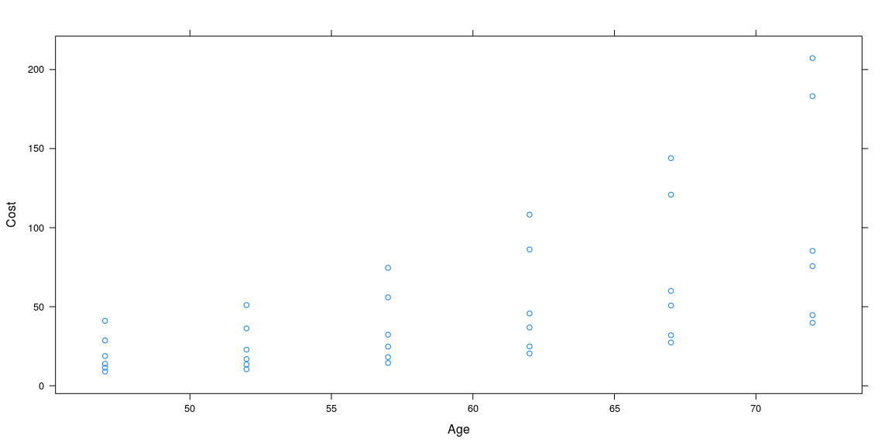
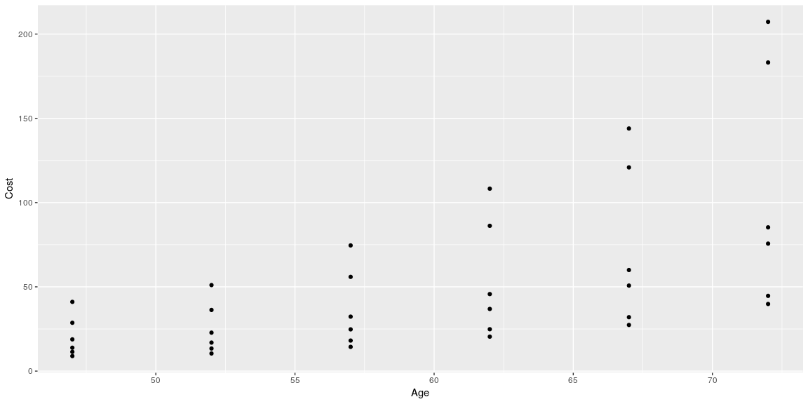
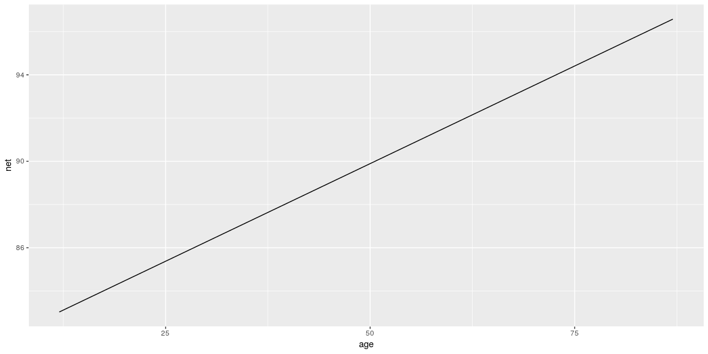
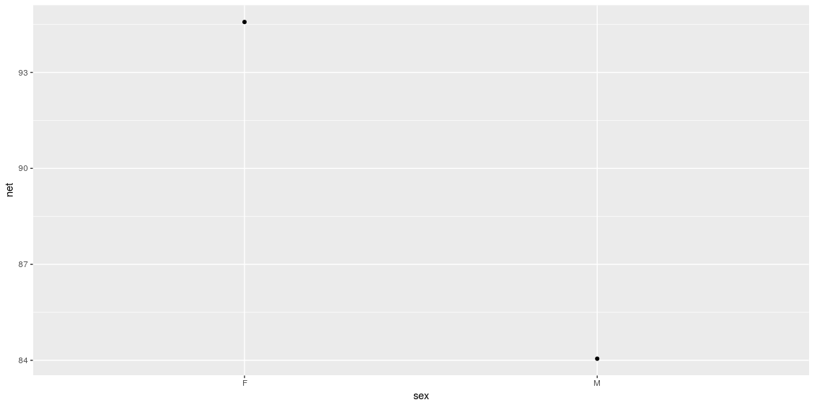

# {.tabset .tabset-fade}


```r
knitr::opts_chunk$set(echo = TRUE, message = FALSE, warning = FALSE)
```


```r
library(ggplot2)
library(tidyverse)
library(mosaic)
library(mosaicData)
# Install devtools if necessary
#install.packages("devtools")

# Install statisticalModeling
devtools::install_github("dtkaplan/statisticalModeling")
library(statisticalModeling)
```


## Background

https://www.datacamp.com/courses/statistical-modeling-in-r-part-1

## What is Statistical Modeling


```r
## Accessing Data

# Use data() to load Trucking_jobs
data("Trucking_jobs", package = "statisticalModeling")

# View the number rows in Trucking_jobs
nrow(Trucking_jobs)
```

```
## [1] 129
```

```r
# Use names() to find variable names in mosaicData::Riders
names(mosaicData::Riders)
```

```
##  [1] "date"    "day"     "highT"   "lowT"    "hi"      "lo"      "precip" 
##  [8] "clouds"  "riders"  "ct"      "weekday" "wday"
```

```r
# Load ggplot2 package
library(ggplot2)

# Look at the head() of diamonds
head(diamonds)
```

```
## # A tibble: 6 x 10
##   carat cut       color clarity depth table price     x     y     z
##   <dbl> <ord>     <ord> <ord>   <dbl> <dbl> <int> <dbl> <dbl> <dbl>
## 1 0.23  Ideal     E     SI2      61.5    55   326  3.95  3.98  2.43
## 2 0.21  Premium   E     SI1      59.8    61   326  3.89  3.84  2.31
## 3 0.23  Good      E     VS1      56.9    65   327  4.05  4.07  2.31
## 4 0.290 Premium   I     VS2      62.4    58   334  4.2   4.23  2.63
## 5 0.31  Good      J     SI2      63.3    58   335  4.34  4.35  2.75
## 6 0.24  Very Good J     VVS2     62.8    57   336  3.94  3.96  2.48
```

```r
##Starting with formulas

data("AARP", package = "statisticalModeling")

# Find the variable names in AARP
names(AARP)
```

```
## [1] "Age"      "Sex"      "Coverage" "Cost"
```

```r
# Find the mean cost broken down by sex
mosaic::mean(Cost~Sex, data = AARP)
```

```
##        F        M 
## 47.29778 57.53056
```

```r
## Graphics with Formulas

# Create a boxplot using base, lattice, or ggplot2
boxplot(Cost ~ Sex, data = AARP)
```

<!-- -->

```r
bwplot(Cost ~ Sex, data = AARP)
```

<!-- -->

```r
gf_boxplot(Cost ~ Sex, data = AARP)
```

<!-- -->

```r
# Make a scatterplot using base, lattice, or ggplot2
plot(Cost ~ Age, data = AARP)
```

<!-- -->

```r
xyplot(Cost ~ Age, data = AARP)
```

<!-- -->

```r
gf_point(Cost ~ Age, data = AARP)
```

<!-- -->

## Designing, training, and evaluating models


```r
## Modeling running times
# Find the variable names in Runners 
names(Runners)
```

```
## [1] "age"            "net"            "gun"            "sex"           
## [5] "year"           "previous"       "nruns"          "start_position"
```

```r
# Build models: handicap_model_1, handicap_model_2, handicap_model_3 
handicap_model_1 <- lm(net~age, data = Runners)
handicap_model_2 <- lm(net~sex, data = Runners)
handicap_model_3 <- lm(net~age+sex, data = Runners)

# For now, here's a way to visualize the models
fmodel(handicap_model_1)
```

<!-- -->

```r
fmodel(handicap_model_2)
```

<!-- -->

```r
fmodel(handicap_model_3)
```

<!-- -->

```r
##Using the recursive partitioning model architecture
```

